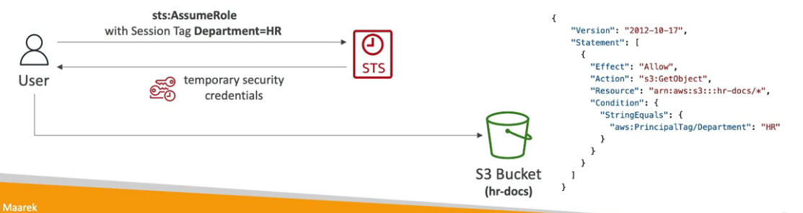
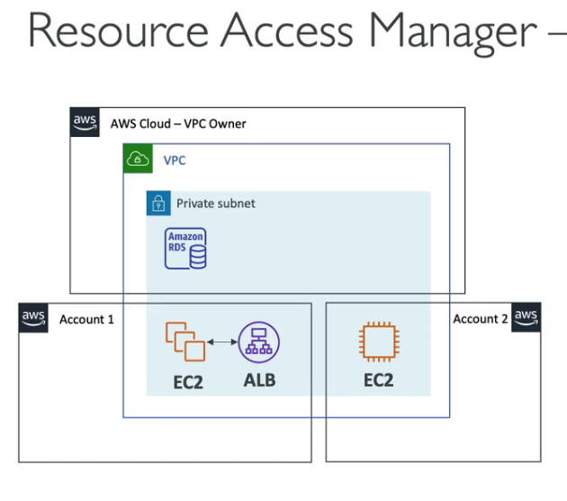
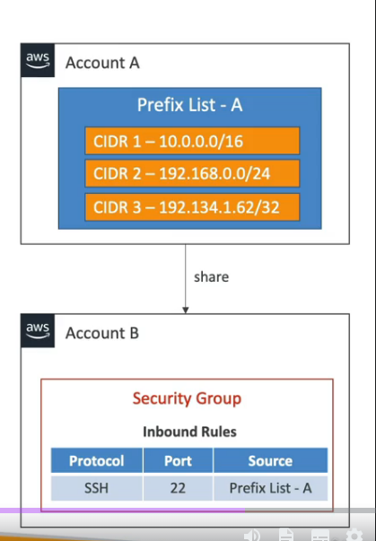
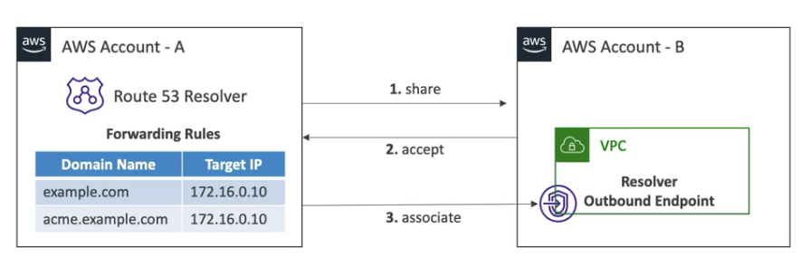

My notes for AWS Solutions Architect Professional Exam
<!--more-->

## IAM

[Access Policies Examples](https://docs.aws.amazon.com/IAM/latest/UserGuide/access_policies_examples.html)

PowerUserAccess

```json
{
    "Version": "2012-10-17",
    "Statement": [
        {
            "Effect": "Allow",
            "NotAction": [
                "iam:*",
                "organizations:*",
                "account:*"
            ],
            "Resource": "*"
        },…
```

```json
…   
    {
    "Effect": "Allow",
    "Action": [
        "iam:CreateServiceLinkedRole",
        "iam:DeleteServiceLinkedRole",
        "iam:ListRoles",
        "organizations:DescribeOrganization",
        "account:ListRegions"
    ],
    "Resource": "*"
    }
  ]
}
```

TODO: Check `NotAction` reference in order to understand better.

- IAM Policies Condition;
- IAM Policies Variable and Tags;

Assuming a role resource give up of his own policies.

TODO: Check `IAM Permission Boundaries` - https://docs.aws.amazon.com/IAM/latest/UserGuide/access_policies_boundaries.html

### IAM Access Analyzer

#### IAM Access Analyzer Policy Validation

Validates grammar and best practices, review it giving warnings and errors and provide actionable recommendations.

#### IAM Access Analyzer Policy Generation

Generates IAM Policy based on logs saved on AWS CloudTrail. For example: a Lambda access Kinesis and S3 Bucket it will analyze for 90 days and it will create a policy based on these apis called, it generate least-privilege policy as a suggestion.

### Providing access to AWS Accounts Owned by Third Parties

For granting acesss to a third party:

- The third party AWS account ID
- An External ID, secret between you and the third party:
    - To uniquely associate with the role between you and third party
    - Must be provided when defining the trust and when assuming the role
    - Must be chosen by the third party
- Define permission in the IAM policy

#### Session Tags in Security Token Service (STS)

Tags that you pass when you assume an IAM Role or federate user in STS (aws:PrincipalTag condition).

Example:


#### STS Important APIs

- AssumeRole
- AssumeRoleWithSAML
- AssumeRoleWithWebIdentity
- GetSessionToken
- GetFederationToken

### Identity Federation

Give users outside of AWS permissions top access AWS resources in your account

**You don't need to create IAM Users (user management is outside AWS)**

Use cases

- A corporate has its own identity system (e.g. Active Directory)
- Web/Mobile application that needs access to AWS resources

Identity federation flavors:

- SAML 2.0
- Custom Identity Broker
- Web Identity Federation With(out) Amazon Cognito
- Single Sign-on (SSO)


AWS Directory Services - AD Connector
AWS Directory Services - Simple AD (Lower cost, only to small to medium businesses)


### AWS Organizations

Root Organizational Unit (OU)
Management Account
Member Account

(Only for created accounts within AWS Organizations) In order to Management Account make changes in Member Account, it is created automatically in each member account a role called **OrganizationAccountAccessRole**, management account assume this role and gain full administrator permissions.

#### Features

- Consolidated billing features:
    - Consolidated billing across all accounts;
    - Pricing benefits from aggregated usage;

- All features:
    - Includes consolidated billing features, **SCP**??;
    - Invited accounts must approve enabling all features;
    - Ability to apply an SCP to prevent member accounts from leaving the org;

#### Reserved Instances (RI)

All accounts can receive hourly cost benefit of RI that are purchased by other account.

Payer account (management account) of an organization can turn off RI and Saving Plans.

#### Moving Accounts

1. Remove member account from Old OU
2. Invite this member account from new OU

#### AWS Service Control Policies (SCP)

Restricting Tags with IAM Policies
    - ForAllValues
    - ForAnyValues
SCP to deny a Region. e.g.: Deny dynamodb on Region us-east-1
Using SCP to Restrict Creating Resources withou appropriate Tags
Tag Policies = consistent tags, you can define tag keys and allowed values for each one
AI Services Opt-out policies
Backup policies

#### AWS IAM Identity Center

Successor of SSO

One login (single sign-on)
Identity providers

You can set Permission Sets. e.g. Permission set can be Full Access associated with one or more Organization Unit (OU) and a group can be assigned in this permission set.

We can create a group called _Developers_ which have full access to Development OU and ReadOnlyAccess to Production OU.

#### AWS Control Tower

Easy to set up and govern a secure and compliant multi-account based on best practices.

Control Tower runs on top of AWS Organizations.

_Account Factory_ = Automates account provisioning, Enables create pre-approved baselines and configuration options for AWS Accounts.

Account Factory uses AWS Service Catalog to provision new AWS Accounts.

_GuardRail_ = Provides ongoing governance for your Control Tower environment.

Example: it can identify a non-compliant resources (e.g. untagged resources), in this case can notify through AWS SNS an admin or a Lambda which action is add tag to these resources.

Guarrals Levels

- Mandatory: Automatically enabled and enforced by Control Tower. e.g. Disallow public Read access to the Log Archive account.

- Strongly Recommended: Based on AWS best practices. e.g. Enable encryption for EBS volumes attached to EC2 instances.

- Elective: Commonly used by enterprises. e.g. Disallow delete actions without MFA in S3 buckets.

#### AWS Resource Access Manager (RAM)

Share AWS resources between AWS Accounts.



_Managed Prefix List_ = A set of one or more CIDR blocks. Makes it easier to configure and maintain Security Groups and RouteTables.



Route 53 Outbound Resolver is shareable as well.



Managed Prefix List = a set of one or more CIDR blocks
Customer-Managed Prefix List and AWS managed prefix list

## Security

### CloudTrail

Provides governance, compliance and audit
History of events / API calls

SDK, CLI, Console, IAM User & IAM Roles are tracked.

CloudTrail Insights = try to detect unusual activity in account.

Retentions = Events are stored for 90 days, to keep events beyond this period you may use S3 and Athena

React to CloudTrail Events:
 - Fastest is AWS EventBridge
 - Delivery in CloudWatch Logs
 - Delivery in S3

### Key Management Service (KMS)

Symmetric keys = use the same key for encryption and decryption
Asymmetric keys = use public key for encryption and decrypts with private key, public key can be share it with other users outside of AWS.

Types of KMS Keys
  - Customer managed keys
  - AWS managed keys
  - AWS owned keys = Use by some AWS services to protect resources, used in multiple AWS accounts, can't view use track or audit.

Key Material Origin

KMS
Creates and manages the key material in its own key store

**External**
We import the key material into the KMS key, we're responsible for securing the key material outside of AWS. Bring your license key (BYOK). We must rotate KMS key.

Custom Key Store
KMS created the key material in a custom key store.

### SSM Parameter Store

Secure storage for configuration and secrets

**Hierarchy**
Hierarchy as file storage, in tree format, IAM policy can control where it is allowed to access.

|                                   | Standard         | Advanced                               |
| --------------------------------- | ---------------- | -------------------------------------- |
| Total number parameters           | 10.000           | 100.000                                |
| Maximum size of a parameter value | 4 KB             | 8KB                                    |
| Parameter policies available      | No               | Yes                                    |
| Cost                              | No charge at all | Charges apply                          |
| Storage pricing                   | Free             | $0.05 per advanced parameter per month |

### Secrets Manager

Capability to force rotation of secrets every X days
Share Cross-Accounts. e.g: Dev Account acess Secrets Manager of Security Account

Rotation with Secrets Manager, it's can invoke every 30 days a lambda function in order to change RDS password

Parameter store can be rotated as well with AWS EventBridge invoking a lambda function which will be responsible to change RDS password and change the value of SSM Parameter Store as well.

### SSL - Sever Name Indication (SNI)

SNI solves the problem of loading **multiple SSL certificates onto one web server** (to serve multiple websites)

It's a __newer__ protocol, and requires the client to indicate the hostname of the targer server in the initial SSL handshake.

**Note: It only works for ALB & NLB, Cloudfront**
**It doesn't work on CLB (older gen)**

### AWS Certificate Manager (ACM)

To host public SSL certificates in AWS
- Buy one and upload it using the CLI
- Have ACM provision and renew public SSL certificates with no charge.

ACM loads SSL certificates on Load Balancers, CloudFront, APIs on API Gateways.

ACM is a regional service, so if we have a global application, we need to issue an SSL certificate in each region without possibility to copy through regions.

### CloudHSM

HSM stands for Hardware Security Module
We must manage our own encryption keys
Good to SSE-C (Server Side Encryption with customer managed keys)

IAM permissions: CRUD an HSM cluster
CloudHSM Software: Manage the keys and users

[Understanding FIPS 140](https://www.youtube.com/watch?v=qwC7Kgj87T0)
[FIPS Cryptography playlist](https://www.youtube.com/playlist?list=PLA-8aGQm6tkKkxZL1IDMDItOAa34KZG0e)

### S3 Security

Encryption at rest
Encryption in transit
S3 bucket policies
Pre-signed URLs

VPC endpoint gateway for S3 = way to access S3 bucket inside AWS network

**S3 Object Lock & Glacier Vault Lock**

They both adopt WORM (Write Once Read Many) model.

S3 Object Lock block an object version deleter for a specified amount of time.

Glacier is helpful for compliance and data retention.

**S3 - Access Points**

Each access point get its own DNS and policy.
- A specific IAM user/group
- One policy per Access Point

VPC acces points to keys in one bucket, so Sales department access only sales key, Finance department access only finance key.


