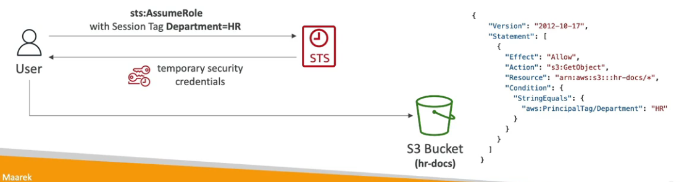
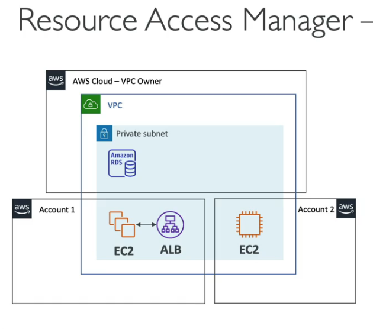
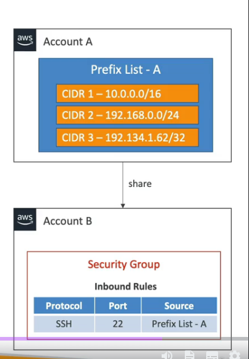
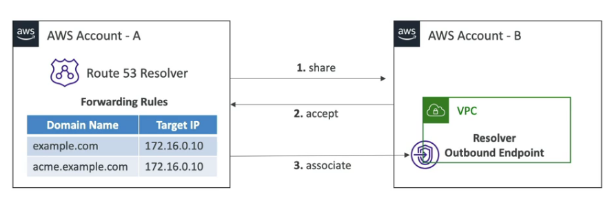

My notes for AWS Solutions Architect Professional Exam
<!--more-->

## IAM

[Access Policies Examples](https://docs.aws.amazon.com/IAM/latest/UserGuide/access_policies_examples.html)

PowerUserAccess

```json
{
    "Version": "2012-10-17",
    "Statement": [
        {
            "Effect": "Allow",
            "NotAction": [
                "iam:*",
                "organizations:*",
                "account:*"
            ],
            "Resource": "*"
        },…
```

```json
…   
    {
    "Effect": "Allow",
    "Action": [
        "iam:CreateServiceLinkedRole",
        "iam:DeleteServiceLinkedRole",
        "iam:ListRoles",
        "organizations:DescribeOrganization”,
        "account:ListRegions"
    ],
    "Resource": "*"
    }
  ]
}
```

TODO: Check `NotAction` reference in order to understand better.

- IAM Policies Condition;
- IAM Policies Variable and Tags;

Assuming a role resource give up of his own policies.

TODO: Check `IAM Permission Boundaries` - https://docs.aws.amazon.com/IAM/latest/UserGuide/access_policies_boundaries.html

### IAM Access Analyzer

#### IAM Access Analyzer Policy Validation

Validates grammar and best practices, review it giving warnings and errors and provide actionable recommendations.

#### IAM Access Analyzer Policy Generation

Generates IAM Policy based on logs saved on AWS CloudTrail. For example: a Lambda access Kinesis and S3 Bucket it will analyze for 90 days and it will create a policy based on these apis called, it generate least-privilege policy as a suggestion.

### Providing access to AWS Accounts Owned by Third Parties

For granting acesss to a third party:

- The third party AWS account ID
- An External ID, secret between you and the third party:
    - To uniquely associate with the role between you and third party
    - Must be provided when defining the trust and when assuming the role
    - Must be chosen by the third party
- Define permission in the IAM policy

#### Session Tags in Security Token Service (STS)

Tags that you pass when you assume an IAM Role or federate user in STS (aws:PrincipalTag condition).

Example:


#### STS Important APIs

- AssumeRole
- AssumeRoleWithSAML
- AssumeRoleWithWebIdentity
- GetSessionToken
- GetFederationToken

### Identity Federation

Give users outside of AWS permissions top access AWS resources in your account

**You don't need to create IAM Users (user management is outside AWS**

Use cases

- A corporate has its own identity system (e.g. Active Directory)
- Web/Mobile application that needs access to AWS resources

Identity federation flavors:

- SAML 2.0
- Custom Identity Broker
- Web Identity Federation With(out) Amazon Cognito
- Single Sign-on (SSO)


AWS Directory Services - AD Connector
AWS Directory Services - Simple AD (Lower cost, only to small to medium businesses)


### AWS Organizations

Root Organizational Unit (OU)
Management Account
Member Account

(Only for created accounts within AWS Organizations) In order to Management Account make changes in Member Account, it is created automatically in each member account a role called **OrganizationAccountAccessRole**, management account assume this role and gain full administrator permissions.

#### Features

- Consolidated billing features:
    - Consolidated billing across all accounts;
    - Pricing benefits from aggregated usage;

- All features:
    - Includes consolidated billing features, **SCP**??;
    - Invited accounts must approve enabling all features;
    - Ability to apply an SCP to prevent member accounts from leaving the org;

#### Reserved Instances (RI)

All accounts can receive hourly cost benefit of RI that are purchased by other account.

Payer account (management account) of an organization can turn off RI and Saving Plans.

#### Moving Accounts

1. Remove member account from Old OU
2. Invite this member account from new OU

#### AWS Service Control Policies (SCP)

Restricting Tags with IAM Policies
    - ForAllValues
    - ForAnyValues
SCP to deny a Region. e.g.: Deny dynamodb on Region us-east-1
Using SCP to Restrict Creating Resources withou appropriate Tags
Tag Policies = consistent tags, you can define tag keys and allowed values for each one
AI Services Opt-out policies
Backup policies

#### AWS IAM Identity Center

Successor of SSO

One login (single sign-on)
Identity providers

You can set Permission Sets. e.g. Permission set can be Full Access associated with one or more Organization Unit (OU) and a group can be assigned in this permission set.

We can create a group called _Developers_ which have full access to Development OU and ReadOnlyAccess to Production OU.

#### AWS Control Tower

Easy to set up and govern a secure and compliant multi-account based on best practices.

Control Tower runs on top of AWS Organizations.

_Account Factory_ = Automates account provisioning, Enables create pre-approved baselines and configuration options for AWS Accounts.

Account Factory uses AWS Service Catalog to provision new AWS Accounts.

_GuardRail_ = Provides ongoing governance for your Control Tower environment.

Example: it can identify a non-compliant resources (e.g. untagged resources), in this case can notify through AWS SNS an admin or a Lambda which action is add tag to these resources.

Guarrals Levels

- Mandatory: Automatically enabled and enforced by Control Tower. e.g. Disallow public Read access to the Log Archive account.

- Strongly Recommended: Based on AWS best practices. e.g. Enable encryption for EBS volumes attached to EC2 instances.

- Elective: Commonly used by enterprises. e.g. Disallow delete actions without MFA in S3 buckets.

#### AWS Resource Access Manager (RAM)

Share AWS resources between AWS Accounts.



_Managed Prefix List_ = A set of one or more CIDR blocks. Makes it easier to configure and maintain Security Groups and RouteTables.



Route 53 Outbound Resolver is shareable as well.

